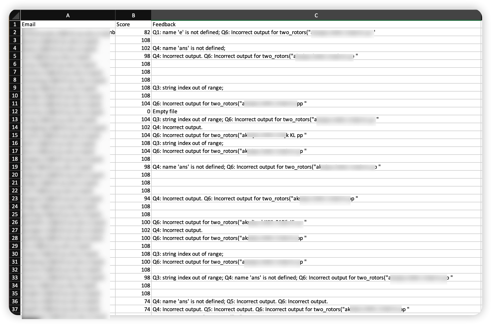

# cs101-auto-grader

## Brief
Auto grader for CS101 (Fall 2022) Python lab assignments.

## Features
- Grade around 280 submissions automatically within 5 min. 
- Contain test cases that are not covered in the student version.
- Automatically calculate each student' score and generate individual feedback for points deducted and store the result in a `.csv` file.
- Raise alarms for invalid files (e.g. broken files, empty submissions, missing questions)
- Main framework is highly reusable. Only test scripts that contain test cases need to be designed for each lab (which is easy).

## Output Example

  
## Requirements
Install all packets in `requirements.txt`.

Besides, in order to make the auto grader work, the following file structure is required:

```console
|---
    |---student_files
        |---lab3
            |---xxx.ipynb
            ...
        |---lab4
            |---xxx.ipynb
            ...
        |---lab5
            ...
        |---lab9
            ...
    |---grades
        |---lab3
            |---(output files with scores and feedback will be here)
        |---lab4
        ...
    |---(test scripts that contain test cases)
```

Test scripts available (**not** in the repo) for lab3, 4, 5 and 9. For future TAs, contact me if needed.
